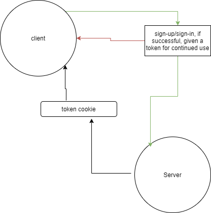

# bearer-auth

> This API is able to allow a user to create an account as well as to handling basic authentication (user provides a username + password). When a “good” login happens, the user is considered to be “authenticated” and a JWT token is generated and signed for them.

****
#UML

***
 [Heroku]()
***
 [pull Request]()
